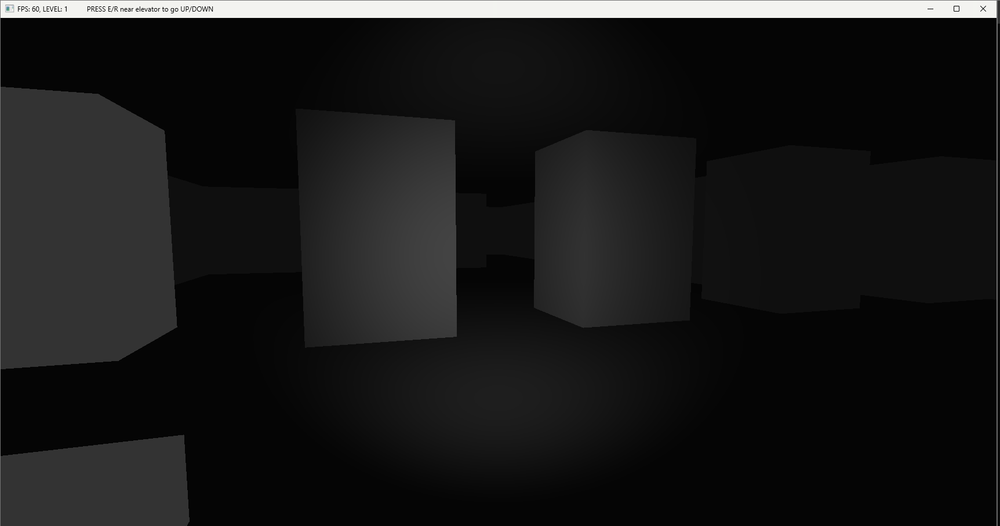
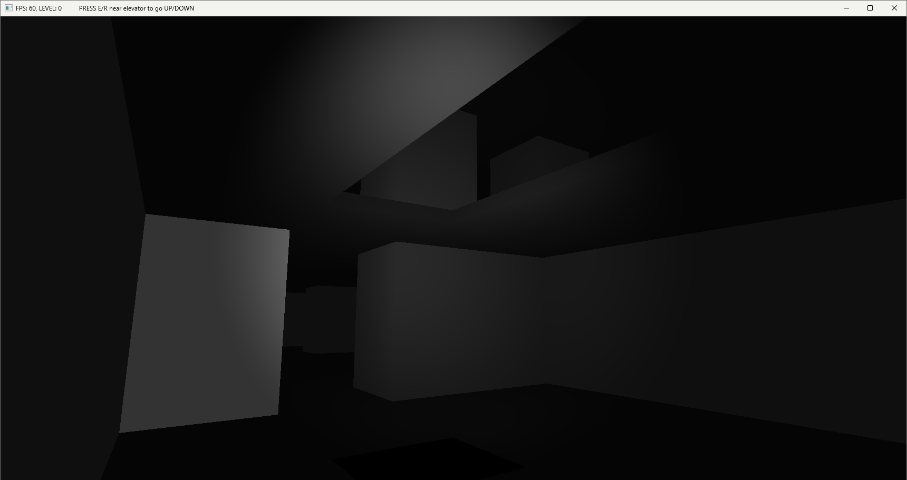

# ZPG Semester Project — 3D First-Person Maze Explorer

A first-person 3D dungeon crawler written from scratch in C# and OpenGL as a semester project for the ZPG course at ZČU FAV.

## About

This is a multi-level 3D maze where you walk around, look around with the mouse, and use elevators to move between floors. The whole world is generated from a plain text file — each character in the grid becomes a wall, floor tile, or elevator in 3D space. It's not a game with a goal, it's more of a sandbox to learn how OpenGL actually works end-to-end.

Built as a semester assignment at ZČU FAV (ZPG). The intent was to implement a complete rendering pipeline without relying on a game engine — no Unity, no Godot, just raw OpenGL calls and math.

---

## Tech Stack


| Layer | Technology |
|---|---|
| Language | C# 12 / .NET 8.0 |
| Graphics API | OpenGL 4.6 (core profile) |
| Windowing & input | OpenTK 4.9.4 (wraps GLFW) |
| Math | OpenTK.Mathematics (vectors, matrices) |
| Shaders | GLSL 4.60 |
| 3D models | Custom OBJ loader |
| Build | MSBuild / .NET SDK |

---

## Features

- **Text-based map format** — levels are defined in `.txt` files using ASCII characters (`x` = wall, `e` = elevator, `@` = spawn); the parser converts the 2D grid into 3D world coordinates
- **Multi-level maps** — the map file supports multiple stacked floors with a `WxHxLevels` header; each floor is a separate grid parsed in sequence
- **Elevator system** — stand near an elevator and press `E`/`R` to go up or down between floors; the engine validates that elevators form continuous vertical shafts across levels
- **Fade transition effect** — level changes play a fade-to-black / fade-from-black animation using a fullscreen quad rendered with a dedicated GLSL shader
- **First-person camera** — perspective projection with mouse look; pitch is clamped to ±90° to prevent flipping
- **AABB collision detection** — axis-aligned bounding box collisions against all wall models on the current floor only; includes wall-sliding so you don't get stuck on corners
- **Gravity & fall detection** — simple gravity simulation with a constant acceleration; if you fall off a ledge below Y = -5 you're teleported back to spawn
- **Camera-attached spotlight** — a spotlight follows and points in the camera's direction; implemented in GLSL with distance attenuation and a configurable cutoff angle
- **OBJ model loading** — minimal OBJ parser that loads vertex positions and normals; used for the wall cube, elevator, and floor tile meshes
- **FPS counter** — frames per second are measured every second and shown in the window title along with the current floor number

---

## Screenshots & Demo

<p align="center">
  
  
</p>

- [Demo video 1](img/maze/Maze2_part1.mp4)
- [Demo video 2](img/maze/Maze2_part2.mp4)
- [Demo video 3](img/maze/Maze2_part3.mp4)

---

## Getting Started

### Prerequisites

- [.NET 8.0 SDK](https://dotnet.microsoft.com/download/dotnet/8.0)
- A GPU that supports OpenGL 4.6 (most hardware from 2012+ does)
- Linux, Windows, or macOS

### Run locally

```bash
# Clone the repo
git clone https://github.com/MatejSulic/zpg_sem_sulic.git
cd zpg_sem_sulic

# Build and run
dotnet run
```

That's it. No extra dependencies to install manually — NuGet will pull OpenTK automatically on first build.

### Controls

| Key | Action |
|---|---|
| `W A S D` | Move |
| Mouse | Look around |
| `E` | Go up (must be near an elevator) |
| `R` | Go down (must be near an elevator) |
| `T` | Teleport back to spawn |
| `Esc` | Quit |

---

## Project Structure

```
zpg_sem_sulic/
├── src/
│   ├── Game.cs               # Main game loop — extends GameWindow, owns all systems
│   ├── GameMap.cs            # Map loading, level parsing, 3D model generation from grid
│   ├── Camera.cs             # First-person camera: view/projection matrices, mouse rotation
│   ├── CollisionHandler.cs   # AABB collision detection, gravity, wall sliding
│   ├── FadeRenderer.cs       # Fullscreen fade-in/out effect for level transitions
│   ├── TeleportHandler.cs    # Moves camera position during a fade transition
│   ├── FPSVisualization.cs   # FPS counter (1-second rolling average)
│   ├── Light.cs              # Spotlight that follows and points with the camera
│   ├── Model.cs              # GPU model: VAO/VBO/IBO setup and draw call
│   ├── Shader.cs             # GLSL shader compilation, linking, uniform management
│   ├── Material.cs           # Material properties (color, diffuse, specular, shininess)
│   ├── Vertex.cs             # Vertex struct (position + normal)
│   ├── Viewport.cs           # Viewport rectangle configuration
│   ├── SimpleObj.cs          # Minimal OBJ file parser
│   ├── maps/
│   │   ├── MapWithLevels.txt # Main 3-floor map (24×17×3)
│   │   └── basicMap.txt      # Simple single-floor map for testing
│   ├── Models/
│   │   ├── cube.obj          # Wall block mesh
│   │   ├── elevator.obj      # Elevator mesh
│   │   └── floorTile.obj     # Floor tile mesh
│   └── shaders/
│       ├── basic.vert / .frag          # Spotlight shader for walls and floors
│       ├── elevatorShader.vert / .frag # Shader for elevator objects
│       └── fade.vert / .frag           # Fullscreen quad shader for fade effect
├── zpg_sem.csproj
└── zpg_sem.sln
```

### Map format

```
24x17x3       ← width × height × number of levels
xxxxxxxx...   ← each character is one tile:
               x = wall (cube placed here)
               e = elevator
               @ = player spawn
               0 = void (no floor tile generated)
               (space or other) = open floor
```

Each floor section follows the previous one in the file. The parser stacks them vertically in 3D space.

---

## What I Learned

- **The OpenGL pipeline is not magic.** You have to set up every buffer yourself — VAO, VBO, IBO — and the order matters. It's easy to draw nothing and have no idea why. Reading GL debug output actually helps.

- **Building a camera from first principles.** Working out view and projection matrices by hand (not copying a tutorial's `LookAt` call) made me actually understand what those matrices do. The difference between world space, view space, and clip space clicked once I had to implement it.

- **AABB collision is simple but the edge cases are not.** The basic overlap check is five lines. Making the player slide along walls instead of stopping dead — and doing it only for the current floor — took a lot more thought.

- **Coordinate systems are where bugs live.** Converting a 2D grid index to a 3D world position sounds trivial. Getting the Y axis right across multiple stacked floors with floor tile offsets took several wrong attempts.

- **A fullscreen quad is a useful trick.** Rendering a fade effect by drawing a semi-transparent quad that covers the entire screen (in NDC space, bypassing the depth test) is simple once you know it's a thing. I had no idea that's how post-processing works before this.

---

## Author

**Matěj Šulič**

[GitHub](https://github.com/MatejSulic) · [LinkedIn](https://linkedin.com/in/matej-sulic) · sul.matej@gmail.com
